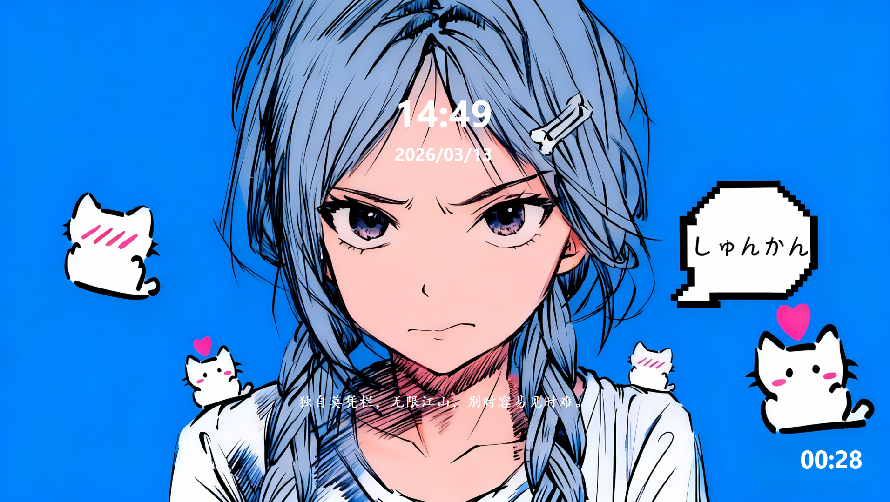
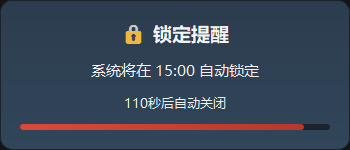
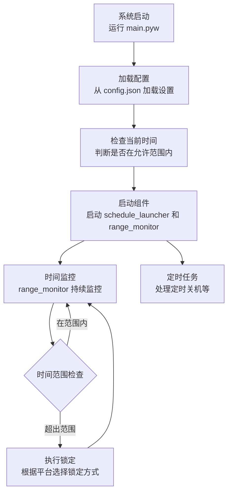

<style>
:root {
    --primary-color: #4a6fa5;
    --secondary-color: #6c757d;
    --box-shadow: 0 4px 6px rgba(0, 0, 0, 0.1);
}

.cover {
    background: linear-gradient(135deg, #ffd700, #4caf50);
    color: #f5f5f5;
    padding: 10px 20px;
    text-align: center;
    border-radius: 8px;
    margin-bottom: 20px;
    box-shadow: var(--box-shadow);
}

.cover h1 {
    font-size: 2.5rem;
    margin-bottom: 10px;
    color: #f5f5f5;
}

.cover p {
    font-size: 1rem;
    opacity: 0.9;
    max-width: 600px;
    margin: 0 auto;
    color: #f5f5f5;
}

.feature-grid {
    display: grid;
    grid-template-columns: repeat(auto-fit, minmax(250px, 1fr));
    gap: 20px;
    margin: 20px 0;
}

.feature-card {
    background: #f8f9fa;
    padding: 20px;
    border-radius: 8px;
    border-left: 4px solid #4caf50;
    transition: transform 0.3s ease;
}

.feature-card:hover {
    transform: translateY(-5px);
    box-shadow: var(--box-shadow);
}

.feature-card h4 {
    color: #4caf50;
    margin-bottom: 10px;
}

.platform-tag {
    background: #4caf50;
    color: white;
    padding: 5px 15px;
    border-radius: 20px;
    font-size: 0.9rem;
    display: inline-block;
    margin: 5px;
}

.image-container {
    text-align: center;
    margin: 20px 0;
}

.image-container img {
    max-width: 100%;
    height: auto;
    border-radius: 8px;
    box-shadow: var(--box-shadow);
}

.image-container p {
    margin-top: 10px;
    font-weight: 500;
    color: var(--secondary-color);
}
</style>

<div class="cover">
    <h1>TimeLock 定时锁机</h1>
    <p>智能时间锁定系统 - 合理管理使用时间，养成良好习惯</p>
</div>

<div align="center">
  
  
  
  
  
  
  
</div>

## 项目简介

TimeLock是一款专业的智能时间管理工具，基于Python开发，支持Windows和Linux双平台，通过自动化的时间锁定机制帮助用户有效管理电脑使用时间。系统能够根据预设的时间范围自动锁定和解锁电脑，实现工作与休息时间的科学分配，支持跨日时间范围判断，确保锁定逻辑准确可靠。

核心价值在于帮助用户养成良好的时间使用习惯，提高工作和学习效率，适用于企业、个人、学生等各类用户群体。

## 功能特点

<div class="feature-grid">
    <div class="feature-card">
        <h4>智能时间管理</h4>
        <p>根据配置的时间范围自动锁定系统，支持跨夜锁定</p>
    </div>
    <div class="feature-card">
        <h4>跨平台支持</h4>
        <p>支持 Windows 和 Linux 平台，提供不同的锁定方式</p>
    </div>
    <div class="feature-card">
        <h4>全屏休息模式</h4>
        <p>提供美观的全屏休息界面，支持壁纸和诗词显示</p>
    </div>
    <div class="feature-card">
        <h4>灵活配置</h4>
        <p>通过配置文件自定义时间范围、提醒设置和界面样式</p>
    </div>
    <div class="feature-card">
        <h4>关机功能</h4>
        <p>可设置自动关机时间，确保按时休息</p>
    </div>
    <div class="feature-card">
        <h4>提醒功能</h4>
        <p>在锁定前提供提醒，让用户有时间保存工作</p>
    </div>
</div>

## 程序运行截图
</div>

<div class="image-container">
    
    <p>系统锁定</p>
</div>

<div class="image-container">
    
    <p>锁定提醒</p>
</div>

## 安装方法

### 前提条件

- Python 3.6 或更高版本
- Windows 或 Linux 操作系统

### 安装步骤

1. 克隆或下载项目到本地
2. 确保已安装 Python 3.6+
3. 需要安装PyQt5（用于提醒界面）：

```bash
pip install PyQt5
```

## 使用说明

## 运行逻辑流程

为了帮助您更好地理解系统的运行原理，以下是 TimeLock System 的运行逻辑流程图：



### 启动程序

在项目目录中运行以下命令：

```bash
python main.pyw
```

系统会自动检查当前时间是否在允许范围内，如果不在，则立即锁定系统。

### 开机自启（Windows）

1. 创建 main.pyw 的快捷方式
2. 将快捷方式复制到启动文件夹（Win+R 输入 shell:startup）

### 开机自启（Linux）

1. **创建启动脚本**：
   - 在项目目录中创建 `timelock.sh` 文件，内容如下：

```bash
#!/bin/bash
# TimeLock System 启动脚本
cd /path/to/timelock-system # 此处路径请更换为实际路径
python3 main.pyw
```

2. **添加执行权限**：

```bash
chmod +x timelock.sh
```

3. **创建 Desktop 文件**：
   - 创建 `timelock.desktop` 文件，内容如下：

```
[Desktop Entry]
Type=Application
Name=TimeLock System
Exec=/path/to/timelock-system/timelock.sh
Comment=智能时间锁定系统
Terminal=false
Categories=Utility;
X-GNOME-Autostart-enabled=true
```

4. **将 Desktop 文件放入自启动目录**：

```bash
mkdir -p ~/.config/autostart
cp timelock.desktop ~/.config/autostart/
```

**注意**：请将 `/path/to/timelock-system` 替换为您实际的项目路径。

## 配置说明

系统通过 `config.json` 文件进行配置，以下是完整的配置项解释：

### 时间范围配置

设置允许使用计算机的时间范围，格式为 24 小时制：

```json
{
  "time_ranges": [
    {"start": "08:30", "end": "09:55"},
    {"start": "10:15", "end": "11:45"},
    {"start": "12:50", "end": "15:55"},
    {"start": "16:15", "end": "17:30"},
    {"start": "18:25", "end": "21:30"}
  ]
}
```

- `time_ranges` - 时间范围数组，每个元素包含：
  - `start` - 允许使用的开始时间（24小时制，格式：HH:MM）
  - `end` - 允许使用的结束时间（24小时制，格式：HH:MM）

### 系统配置

- `shutdown_time` - 自动关机时间（24小时制，格式：HH:MM）

### 提醒配置

```json
"reminder": {
  "show_before_minutes": 2
}
```

- `reminder.show_before_minutes` - 锁定前提醒时间（分钟），系统会在锁定前的指定分钟数显示提醒

### 休息界面配置

```json
"break_ui": {
  "wallpaper_path": "/mnt/DATA/Administrator/图片/横屏壁纸/",
  "wallpaper_path_windows": "D:\\Administrator\\图片\\横屏壁纸\\",
  "opacity": 0.85,
  "blur_effect": true,
  "blur_radius": 5,
  "show_poem": true,
  "poem_api": "https://v1.jinrishici.com/all.json",
  "font_color": "#ffd700",
  "font_color_options": [
    "#fff",
    "#ffd700",
    "#00ff00",
    "#ff6b6b"
  ]
}
```

- `break_ui.wallpaper_path` - Linux 系统下的壁纸目录路径
- `break_ui.wallpaper_path_windows` - Windows 系统下的壁纸目录路径
- `break_ui.opacity` - 休息界面的透明度（0.0-1.0）
- `break_ui.blur_effect` - 是否启用模糊效果（true/false）
- `break_ui.blur_radius` - 模糊效果的半径（像素）
- `break_ui.show_poem` - 是否显示诗词（true/false）
- `break_ui.poem_api` - 诗词 API 地址
- `break_ui.font_color` - 文字颜色（十六进制颜色码）
- `break_ui.font_color_options` - 可选的文字颜色列表
>配置中的路径替换为你的壁纸目录的实际路径

### 配置示例

以下是完整的配置文件示例：

```json
{
  "time_ranges": [
    {"start": "08:30", "end": "09:55"},
    {"start": "10:15", "end": "11:45"},
    {"start": "12:50", "end": "15:55"},
    {"start": "16:15", "end": "17:30"},
    {"start": "18:25", "end": "21:30"}
  ],
  "shutdown_time": "21:30",
  "reminder": {
    "show_before_minutes": 2
  },
  "break_ui": {
    "wallpaper_path": "/path/to/wallpapers/",
    "wallpaper_path_windows": "C:\\path\\to\\wallpapers\\",
    "opacity": 0.85,
    "blur_effect": true,
    "blur_radius": 5,
    "show_poem": true,
    "poem_api": "https://v1.jinrishici.com/all.json",
    "font_color": "#ffd700",
    "font_color_options": [
      "#fff",
      "#ffd700",
      "#00ff00",
      "#ff6b6b"
    ]
  }
}
```

## 单独运行组件

除了作为完整系统运行外，您还可以单独运行某些组件来测试或使用特定功能：

### fullscreen_break.pyw

**功能**：显示全屏休息界面，支持壁纸和诗词显示

**运行方式**：

```bash
# 运行指定分钟数的休息界面
python fullscreen_break.pyw <分钟数>

# 示例：运行5分钟的休息界面
python fullscreen_break.pyw 5
```

**说明**：
- 会显示一个全屏的休息界面
- 从配置的壁纸目录中随机选择壁纸
- 如果启用了诗词功能，会显示随机诗词
- 界面会在指定的分钟数后自动关闭

### test_lock.pyw

**功能**：测试系统的锁定和解锁功能，验证时间范围设置是否正确生效

**运行方式**：

```bash
python test_lock.pyw
```

**详细逻辑**：

1. **加载配置**：读取 config.json 文件并保存原始配置
2. **修改时间范围**：
   - 设置第一个时间范围：当前时间-1分钟 到 当前时间+show_before_minutes+1分钟
   - 设置第二个时间范围：当前时间+show_before_minutes+2分钟 到 当前时间-2分钟（跨夜）
3. **启动测试**：运行 main.pyw 进行测试
4. **等待过程**：等待4分钟让锁定和解锁过程完成
5. **清理**：终止 main.pyw 进程并恢复原始配置

**测试结果说明**：
- 系统应该在计算的锁定时间自动锁定
- 系统应该在计算的解锁时间后自动解锁
- 解锁后系统不应该重新锁定
- 测试完成后配置文件已恢复为原始状态

**注意**：测试过程中会修改配置文件，但测试完成后会自动恢复原始配置，不会影响系统的正常使用。

## 平台支持

<div>
    <span class="platform-tag">Windows</span>
    <span class="platform-tag">Linux</span>
</div>

系统会根据不同平台自动选择合适的锁定方式：

- **Windows**：使用系统内置锁定功能
- **Linux**：优先使用全屏休息模式，其次尝试系统锁定命令


## 贡献

欢迎对项目提出建议和改进。如果您发现问题或有新功能想法，请提交 issue 或 pull request。

---

&copy; 2026 TimeLock System. All rights reserved.